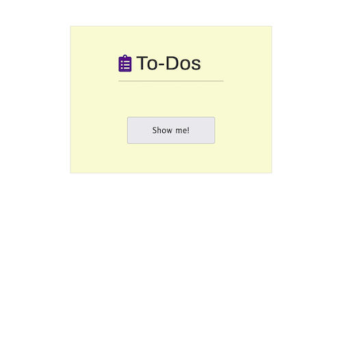
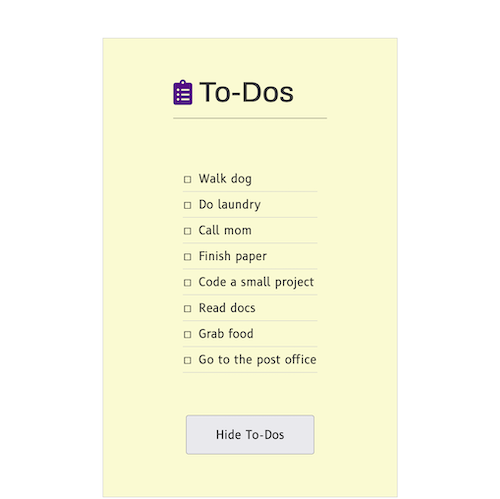

NEW README

<!-- TABLE OF CONTENTS -->

  
Table of Contents

  <ol>
    <li>
      <a href="#about-the-project">About The Project</a>
      <ul>
        <li><a href="#built-with">Built With</a></li>
      </ul>
    </li>
    <li>
      <a href="#getting-started">Getting Started</a>
      <ul>
        <li><a href="#prerequisites">Prerequisites</a></li>
        <li><a href="#installation">Installation</a></li>
      </ul>
    </li>
    <li><a href="#usage">Usage</a></li>
    <li><a href="#roadmap">Roadmap</a></li>
    <li><a href="#contributing">Contributing</a></li>
    <li><a href="#license">License</a></li>
    <li><a href="#contact">Contact</a></li>
    <li><a href="#acknowledgments">Acknowledgments</a></li>
  </ol>

<!-- ABOUT THE PROJECT -->

## About The Project

This is a JavaScript debugging project that implements:

-   Click event handlers with conditional statements.
-   The forEach method.
-   Creating and appending HTML elements.
-   Adding and removing CSS classes.
-   Dom rendering

Click the button to render a nicely formatted to-do list to the web page.

(<a href="#readme-top">back to top</a>)

### Built With

-   HTML
-   CSS
-   JavaScript

(<a href="#readme-top">back to top</a>)

<!-- GETTING STARTED -->

## Getting Started

This web page was crafted with vanilla code. No dependencies here!

### Prerequisites

All you need is a browser (to view/interact) and a text editor (to modify).

### Installation

1. Clone this repo and you're all set!

(<a href="#readme-top">back to top</a>)

<!-- USAGE EXAMPLES -->

## Usage

-   `index.html`: structure and layout.
-   `styles.css`: design and aesthetics.
-   `script.js`: functionality.

(<a href="#readme-top">back to top</a>)

<!-- ROADMAP -->

## Roadmap

There are no plans to implement additional features at this time.

(<a href="#readme-top">back to top</a>)

<!-- CONTRIBUTING -->

## Contributing

This project is for learning/demonstration and is not being actively developed.

(<a href="#readme-top">back to top</a>)

<!-- LICENSE -->

## License

Distributed under the [MIT License](https://choosealicense.com/licenses/mit/).

(<a href="#readme-top">back to top</a>)

<!-- CONTACT -->

## Contact

Nate: [GitHub](https://github.com/nvsmith) | [Grepper](https://www.grepper.com/profile/intra)

(<a href="#readme-top">back to top</a>)

<!-- ACKNOWLEDGMENTS -->

## Acknowledgments

#### Skillcrush - JavaScript Fundamentals

-   Module 6: Scope
    -   Step 6 of 6: Practice Exercises: Scope
        -   Exercise #3
-   [normalize.css](github.com/necolas/normalize.css)

#### README Template

-   [Best-README-Template](https://github.com/othneildrew/Best-README-Template/tree/master)

(<a href="#readme-top">back to top</a>)

